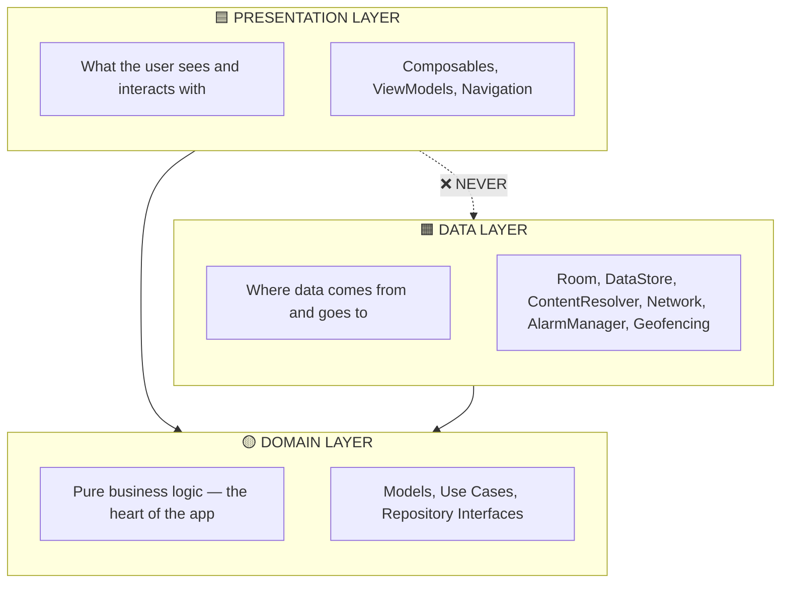
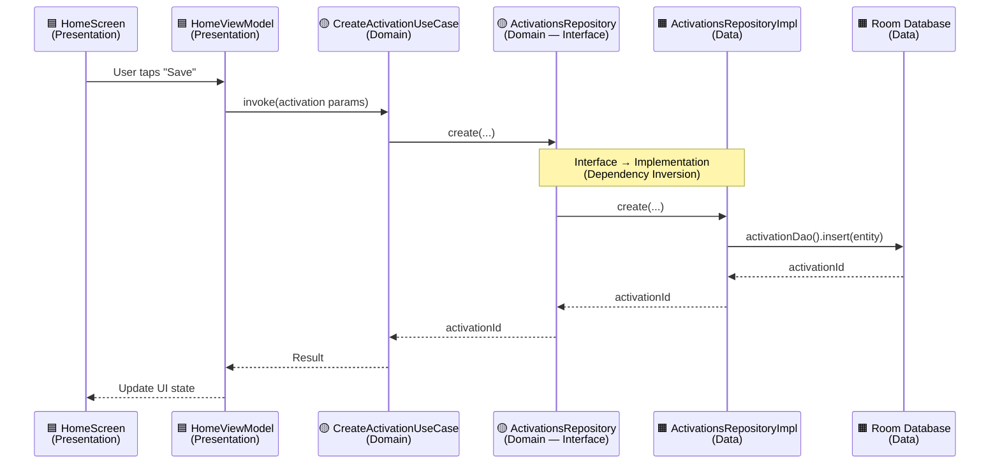
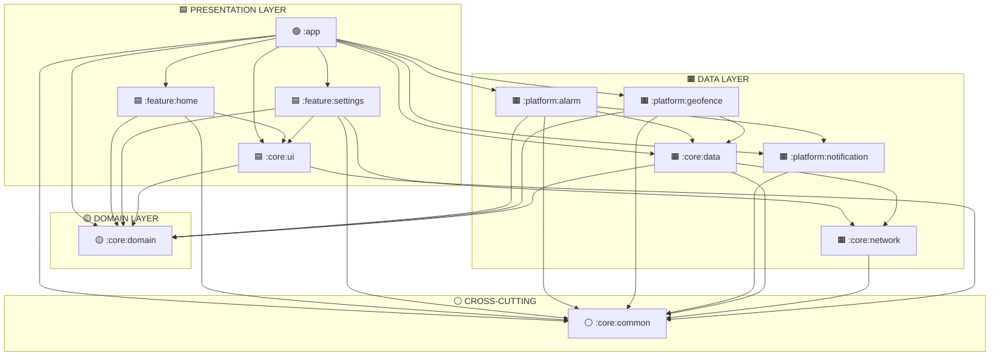

# 🏗️ Contactly — Multi-Module Clean Architecture Plan (Final)

> [!IMPORTANT]
> Every file's placement is based on **actual import analysis**. This is the final version with all feedback incorporated.

---

## The 3 Layers of Clean Architecture



> [!IMPORTANT]
> **The Golden Rule:** Dependencies point **inward toward Domain**.
> - Presentation → Domain ✅
> - Data → Domain ✅ (implements domain interfaces)
> - Presentation → Data ❌ **NEVER** (ViewModels never touch Room/DataStore directly)
> - Domain → anything else ❌ **NEVER** (Domain is pure, knows nothing about the outside world)

---

## How the 11 Modules Map to 3 Layers

```
┌──────────────────────────────────────────────────────────────────┐
│                    🟦 PRESENTATION LAYER                        │
│                                                                  │
│   :app                 — Application, MainActivity, Navigation   │
│   :feature:home        — HomeScreen, HomeViewModel               │
│   :feature:settings    — SettingScreen, SettingsViewModel        │
│   :core:ui             — Theme, shared composables, animations   │
│                                                                  │
├──────────────────────────────────────────────────────────────────┤
│                      🟡 DOMAIN LAYER                            │
│                                                                  │
│   :core:domain         — Models, Repository Interfaces,          │
│                          Use Cases (Pure Kotlin — NO Android)    │
│                                                                  │
├──────────────────────────────────────────────────────────────────┤
│                       🟧 DATA LAYER                             │
│                                                                  │
│   :core:data           — Room, DataStore, Repository Impls       │
│   :core:network        — Ktor client (CIO), API calls (Pure Kotlin) │
│   :platform:alarm      — AlarmManager, alarm receivers           │
│   :platform:geofence   — Geofencing, geofence receiver           │
│   :platform:notification — Notification channels & helpers       │
│                                                                  │
├──────────────────────────────────────────────────────────────────┤
│                    ⚪ CROSS-CUTTING                              │
│                                                                  │
│   :core:common         — Enums, pure utilities, interfaces       │
│                          (Available to ALL layers)               │
│                                                                  │
└──────────────────────────────────────────────────────────────────┘
```

### Detailed Module → Layer Mapping

| # | Module | Layer | Android? | What It Contains |
|---|--------|-------|----------|------------------|
| | | **🟦 PRESENTATION** | | |
| 1 | `:app` | Presentation | ✅ | DI wiring, Application, MainActivity, Navigation |
| 2 | `:feature:home` | Presentation | ✅ Compose | HomeScreen, HomeViewModel, editing components |
| 3 | `:feature:settings` | Presentation | ✅ Compose | SettingScreen, SettingsViewModel, WebView |
| 4 | `:core:ui` | Presentation | ✅ Compose | Theme, shared composables, animation utilities |
| | | **🟡 DOMAIN** | | |
| 5 | `:core:domain` | Domain | ❌ Pure Kotlin | Models, Repository Interfaces, Use Cases |
| | | **🟧 DATA** | | |
| 6 | `:core:data` | Data | ✅ | Room, DataStore, Repository Impls, Android utils |
| 7 | `:core:network` | Data | ❌ Pure Kotlin | Ktor CIO client, API, network models (testable on JVM) |
| 8 | `:platform:alarm` | Data | ✅ | AlarmManager, alarm receivers |
| 9 | `:platform:geofence` | Data | ✅ | Geofencing, geofence receiver |
| 10 | `:platform:notification` | Data | ✅ | Notification channels and helpers |
| | | **⚪ CROSS-CUTTING** | | |
| 11 | `:core:common` | Cross-cutting | ❌ Pure Kotlin | Enums, DayUtils, interfaces, StatusEventBus |

---

## How Data Flows Through the 3 Layers

Here's a concrete example — **creating a new activation**:



> [!NOTE]
> Notice how [HomeViewModel](file:///Users/purnendusamanta/Android%20Studio%20Projects/Contactly/app/src/main/java/com/purnendu/contactly/ui/screens/home/HomeViewModel.kt#43-529) (Presentation) never touches `Room` or [ActivationEntity](file:///Users/purnendusamanta/Android%20Studio%20Projects/Contactly/app/src/main/java/com/purnendu/contactly/data/local/room/ActivationEntity.kt#6-27) (Data). It only knows about [Activation](file:///Users/purnendusamanta/Android%20Studio%20Projects/Contactly/app/src/main/java/com/purnendu/contactly/model/Activation.kt#6-25) (Domain model) and `CreateActivationUseCase` (Domain). **This is the power of Clean Architecture.**

---

## Module Dependency Graph (with Layer Colors)



> [!NOTE]
> **`:app`** is the only module that bridges all three layers — because it's the DI wiring layer. It knows about everything but does almost nothing itself.

---

## File Migration Map (Verified by Actual Imports)

### 🟦 PRESENTATION LAYER

#### `:core:ui` — Shared Design System (Compose)

| File | Key Imports | Notes |
|---|---|---|
| `ui/theme/Theme.kt` | `androidx.compose.material3.*` | App theme definition |
| `ui/theme/Color.kt` | `androidx.compose.ui.graphics.Color` | Color palette |
| `ui/theme/Type.kt` | `androidx.compose.material3.Typography` | Typography system |
| [ui/components/ContactlyDialog.kt](file:///Users/purnendusamanta/Android%20Studio%20Projects/Contactly/app/src/main/java/com/purnendu/contactly/ui/components/ContactlyDialog.kt) | `androidx.compose.material3.*` | Reusable dialog |
| [ui/components/ContactlyTimePicker.kt](file:///Users/purnendusamanta/Android%20Studio%20Projects/Contactly/app/src/main/java/com/purnendu/contactly/ui/components/ContactlyTimePicker.kt) | `androidx.compose.material3.*` | Time picker |
| [ui/components/SlidingImageCarousel.kt](file:///Users/purnendusamanta/Android%20Studio%20Projects/Contactly/app/src/main/java/com/purnendu/contactly/ui/components/SlidingImageCarousel.kt) | `androidx.compose.foundation.*` | Image carousel |
| [ui/components/ConfirmationDialogState.kt](file:///Users/purnendusamanta/Android%20Studio%20Projects/Contactly/app/src/main/java/com/purnendu/contactly/ui/components/ConfirmationDialogState.kt) | `androidx.compose.runtime.*` | Dialog state holder |
| [utils/AnimationUtils.kt](file:///Users/purnendusamanta/Android%20Studio%20Projects/Contactly/app/src/main/java/com/purnendu/contactly/utils/AnimationUtils.kt) | `androidx.compose.animation.*`, `androidx.compose.ui.*` | Compose animation utilities |

#### `:feature:home` — Home Feature

| File | Notes |
|---|---|
| [ui/screens/home/HomeScreen.kt](file:///Users/purnendusamanta/Android%20Studio%20Projects/Contactly/app/src/main/java/com/purnendu/contactly/ui/screens/home/HomeScreen.kt) | Main home composable (46KB) |
| [ui/screens/home/HomeViewModel.kt](file:///Users/purnendusamanta/Android%20Studio%20Projects/Contactly/app/src/main/java/com/purnendu/contactly/ui/screens/home/HomeViewModel.kt) | Home logic (21KB) |
| `ui/screens/home/components/*` | 13 component files (filter chips, bottom sheet, list items, etc.) |

#### `:feature:settings` — Settings Feature

| File | Notes |
|---|---|
| [ui/screens/setting/SettingScreen.kt](file:///Users/purnendusamanta/Android%20Studio%20Projects/Contactly/app/src/main/java/com/purnendu/contactly/ui/screens/setting/SettingScreen.kt) | Settings composable (28KB) |
| [ui/screens/setting/SettingsViewModel.kt](file:///Users/purnendusamanta/Android%20Studio%20Projects/Contactly/app/src/main/java/com/purnendu/contactly/ui/screens/setting/SettingsViewModel.kt) | Settings logic |
| `ui/screens/setting/components/*` | 5 component files |
| `ui/screens/webView/*` | WebView for feedback/privacy policy |

#### `:app` — Application Wiring

| File | Why It Stays Here |
|---|---|
| [ContactlyApplication.kt](file:///Users/purnendusamanta/Android%20Studio%20Projects/Contactly/app/src/main/java/com/purnendu/contactly/ContactlyApplication.kt) | Application class — must be in `:app` |
| [MainActivity.kt](file:///Users/purnendusamanta/Android%20Studio%20Projects/Contactly/app/src/main/java/com/purnendu/contactly/MainActivity.kt) | Entry point — hosts NavHost, Scaffold, splash screen |
| [MainActivityViewModel.kt](file:///Users/purnendusamanta/Android%20Studio%20Projects/Contactly/app/src/main/java/com/purnendu/contactly/MainActivityViewModel.kt) | Depends on alarm sync + geofence sync across modules |
| [di/AppModule.kt](file:///Users/purnendusamanta/Android%20Studio%20Projects/Contactly/app/src/main/java/com/purnendu/contactly/di/AppModule.kt) | Koin module — wires ALL dependencies from ALL modules |
| [ui/screens/Screen.kt](file:///Users/purnendusamanta/Android%20Studio%20Projects/Contactly/app/src/main/java/com/purnendu/contactly/ui/screens/Screen.kt) | Navigation routes — cross-feature, depends on Compose icons |
| [ui/components/BottomNavigationWithCutout.kt](file:///Users/purnendusamanta/Android%20Studio%20Projects/Contactly/app/src/main/java/com/purnendu/contactly/ui/components/BottomNavigationWithCutout.kt) | App-level navigation UI component |
| [utils/BiometricHelper.kt](file:///Users/purnendusamanta/Android%20Studio%20Projects/Contactly/app/src/main/java/com/purnendu/contactly/utils/BiometricHelper.kt) | Requires `FragmentActivity`, only used in [MainActivity](file:///Users/purnendusamanta/Android%20Studio%20Projects/Contactly/app/src/main/java/com/purnendu/contactly/MainActivity.kt#74-354) |

---

### 🟡 DOMAIN LAYER

#### `:core:domain` — Pure Kotlin (NO `android.*` imports)

| File | Verified Imports | Notes |
|---|---|---|
| [model/Contact.kt](file:///Users/purnendusamanta/Android%20Studio%20Projects/Contactly/app/src/main/java/com/purnendu/contactly/model/Contact.kt) | None | Pure data class |
| [model/Activation.kt](file:///Users/purnendusamanta/Android%20Studio%20Projects/Contactly/app/src/main/java/com/purnendu/contactly/model/Activation.kt) | ~~`@DrawableRes`~~ → removed | ⚠️ Pre-migration fix: Remove annotation. Safe — no runtime impact |
| [model/alarm/AlarmMetadata.kt](file:///Users/purnendusamanta/Android%20Studio%20Projects/Contactly/app/src/main/java/com/purnendu/contactly/model/alarm/AlarmMetadata.kt) | None | Pure data class |
| [model/alarm/AlarmActivationResult.kt](file:///Users/purnendusamanta/Android%20Studio%20Projects/Contactly/app/src/main/java/com/purnendu/contactly/model/alarm/AlarmActivationResult.kt) | None | Pure data class |
| [model/alarm/AlarmCheckResult.kt](file:///Users/purnendusamanta/Android%20Studio%20Projects/Contactly/app/src/main/java/com/purnendu/contactly/model/alarm/AlarmCheckResult.kt) | None | Pure data class |
| [model/alarm/SyncResult.kt](file:///Users/purnendusamanta/Android%20Studio%20Projects/Contactly/app/src/main/java/com/purnendu/contactly/model/alarm/SyncResult.kt) | None | Pure data class |
| [model/alarm/AlarmStatusInfo.kt](file:///Users/purnendusamanta/Android%20Studio%20Projects/Contactly/app/src/main/java/com/purnendu/contactly/model/alarm/AlarmStatusInfo.kt) | ~~[ActivationEntity](file:///Users/purnendusamanta/Android%20Studio%20Projects/Contactly/app/src/main/java/com/purnendu/contactly/data/local/room/ActivationEntity.kt#6-27)~~ → replaced | ⚠️ Pre-migration fix: Use domain fields instead of Room Entity |
| *(NEW)* [repository/ActivationsRepository.kt](file:///Users/purnendusamanta/Android%20Studio%20Projects/Contactly/app/src/main/java/com/purnendu/contactly/data/repository/ActivationsRepository.kt) | — | Interface extracted from current implementation |
| *(NEW)* [repository/ContactsRepository.kt](file:///Users/purnendusamanta/Android%20Studio%20Projects/Contactly/app/src/main/java/com/purnendu/contactly/data/repository/ContactsRepository.kt) | — | Interface extracted from current implementation |
| *(NEW)* `repository/AppPreferences.kt` | — | Interface extracted from current file |
| *(NEW)* Use Cases (8 classes) | — | See [Use Cases section](#use-cases-to-introduce) |

---

### 🟧 DATA LAYER

#### `:core:data` — Room, DataStore, ContentResolver

| File | Key Android Imports | Notes |
|---|---|---|
| [data/local/room/ActivationEntity.kt](file:///Users/purnendusamanta/Android%20Studio%20Projects/Contactly/app/src/main/java/com/purnendu/contactly/data/local/room/ActivationEntity.kt) | `androidx.room.*` | Room Entity |
| [data/local/room/ActivationDao.kt](file:///Users/purnendusamanta/Android%20Studio%20Projects/Contactly/app/src/main/java/com/purnendu/contactly/data/local/room/ActivationDao.kt) | `androidx.room.*` | Room DAO |
| [data/local/room/AppDatabase.kt](file:///Users/purnendusamanta/Android%20Studio%20Projects/Contactly/app/src/main/java/com/purnendu/contactly/data/local/room/AppDatabase.kt) | `androidx.room.*`, `android.content.Context` | Room Database |
| [data/local/room/Migrations.kt](file:///Users/purnendusamanta/Android%20Studio%20Projects/Contactly/app/src/main/java/com/purnendu/contactly/data/local/room/Migrations.kt) | `androidx.room.migration.*` | SQL migrations |
| `data/local/preferences/AppPreferencesImpl.kt` | `android.content.Context`, `androidx.datastore.*` | DataStore impl (split from interface) |
| `data/repository/ActivationsRepositoryImpl.kt` | `com.google.gson.*` | Implements domain interface |
| `data/repository/ContactsRepositoryImpl.kt` | `android.content.ContentResolver` | Implements domain interface |
| [utils/AndroidPermissionChecker.kt](file:///Users/purnendusamanta/Android%20Studio%20Projects/Contactly/app/src/main/java/com/purnendu/contactly/utils/AndroidPermissionChecker.kt) | `android.content.Context`, `android.app.AlarmManager` | Implements [PermissionChecker](file:///Users/purnendusamanta/Android%20Studio%20Projects/Contactly/app/src/main/java/com/purnendu/contactly/utils/PermissionChecker.kt#7-12) from `:core:common` |
| [utils/ImageStorageManager.kt](file:///Users/purnendusamanta/Android%20Studio%20Projects/Contactly/app/src/main/java/com/purnendu/contactly/utils/ImageStorageManager.kt) | `android.content.Context` | Image file I/O |
| [utils/NetworkCheck.kt](file:///Users/purnendusamanta/Android%20Studio%20Projects/Contactly/app/src/main/java/com/purnendu/contactly/utils/NetworkCheck.kt) | `android.content.Context`, `android.net.ConnectivityManager` | Network connectivity |
| [utils/DeviceTimeValidator.kt](file:///Users/purnendusamanta/Android%20Studio%20Projects/Contactly/app/src/main/java/com/purnendu/contactly/utils/DeviceTimeValidator.kt) | `android.content.Context` | Depends on `:core:network` |
| [utils/GoogleMapsUrlParser.kt](file:///Users/purnendusamanta/Android%20Studio%20Projects/Contactly/app/src/main/java/com/purnendu/contactly/utils/GoogleMapsUrlParser.kt) | `android.util.Log` | URL parsing |

#### `:core:network` — Pure Kotlin (Ktor CIO, Serialization)

| File | Key Imports | Notes |
|---|---|---|
| [networking/KtorClient.kt](file:///Users/purnendusamanta/Android%20Studio%20Projects/Contactly/app/src/main/java/com/purnendu/contactly/networking/KtorClient.kt) | `io.ktor.client.engine.cio.CIO` | ⚡ Pure Kotlin CIO engine (replaces Android engine) |
| [networking/ApiInterface.kt](file:///Users/purnendusamanta/Android%20Studio%20Projects/Contactly/app/src/main/java/com/purnendu/contactly/networking/ApiInterface.kt) | `io.ktor.client.*` | Time API calls |
| [networking/model/TimeApiResponse.kt](file:///Users/purnendusamanta/Android%20Studio%20Projects/Contactly/app/src/main/java/com/purnendu/contactly/networking/model/TimeApiResponse.kt) | `kotlinx.serialization.Serializable` | Network response DTO |

#### `:platform:alarm` — AlarmManager, BroadcastReceivers

| File | Key Android Imports | Notes |
|---|---|---|
| [manager/ContactlyAlarmManager.kt](file:///Users/purnendusamanta/Android%20Studio%20Projects/Contactly/app/src/main/java/com/purnendu/contactly/manager/ContactlyAlarmManager.kt) | `android.app.AlarmManager`, `android.app.PendingIntent` | 503 lines |
| [receiver/AliasAlarmReceiver.kt](file:///Users/purnendusamanta/Android%20Studio%20Projects/Contactly/app/src/main/java/com/purnendu/contactly/receiver/AliasAlarmReceiver.kt) | `android.content.BroadcastReceiver` | Fires on alarm trigger |
| [receiver/ReActivationReceiver.kt](file:///Users/purnendusamanta/Android%20Studio%20Projects/Contactly/app/src/main/java/com/purnendu/contactly/receiver/ReActivationReceiver.kt) | `android.content.BroadcastReceiver` | Re-registers after boot |

#### `:platform:geofence` — Google Play Services

| File | Key Android Imports | Notes |
|---|---|---|
| [manager/ContactlyGeofenceManager.kt](file:///Users/purnendusamanta/Android%20Studio%20Projects/Contactly/app/src/main/java/com/purnendu/contactly/manager/ContactlyGeofenceManager.kt) | `com.google.android.gms.location.*` | Geofence registration |
| [receiver/GeofenceBroadcastReceiver.kt](file:///Users/purnendusamanta/Android%20Studio%20Projects/Contactly/app/src/main/java/com/purnendu/contactly/receiver/GeofenceBroadcastReceiver.kt) | `android.content.BroadcastReceiver` | Transition handler |

#### `:platform:notification` — NotificationManager

| File | Key Android Imports | Notes |
|---|---|---|
| [notification/NotificationHelper.kt](file:///Users/purnendusamanta/Android%20Studio%20Projects/Contactly/app/src/main/java/com/purnendu/contactly/notification/NotificationHelper.kt) | `android.app.NotificationChannel`, `NotificationCompat` | Channel + sending |

---

### ⚪ CROSS-CUTTING (Available to ALL Layers)

#### `:core:common` — Pure Kotlin

| File | Verified Imports | Notes |
|---|---|---|
| [utils/AppEnums.kt](file:///Users/purnendusamanta/Android%20Studio%20Projects/Contactly/app/src/main/java/com/purnendu/contactly/utils/AppEnums.kt) | None | [ViewMode](file:///Users/purnendusamanta/Android%20Studio%20Projects/Contactly/app/src/main/java/com/purnendu/contactly/utils/AppEnums.kt#3-7), [ActivationMode](file:///Users/purnendusamanta/Android%20Studio%20Projects/Contactly/app/src/main/java/com/purnendu/contactly/utils/AppEnums.kt#8-31), [AppThemeMode](file:///Users/purnendusamanta/Android%20Studio%20Projects/Contactly/app/src/main/java/com/purnendu/contactly/utils/AppEnums.kt#32-37) |
| [utils/AlarmRequestCodeUtils.kt](file:///Users/purnendusamanta/Android%20Studio%20Projects/Contactly/app/src/main/java/com/purnendu/contactly/utils/AlarmRequestCodeUtils.kt) | None | Pure math for request codes |
| [utils/DayUtils.kt](file:///Users/purnendusamanta/Android%20Studio%20Projects/Contactly/app/src/main/java/com/purnendu/contactly/utils/DayUtils.kt) | `java.util.Calendar` | `java.*` — not Android |
| [utils/PermissionChecker.kt](file:///Users/purnendusamanta/Android%20Studio%20Projects/Contactly/app/src/main/java/com/purnendu/contactly/utils/PermissionChecker.kt) | None | Pure interface |
| [ui/screens/home/StatusEventBus.kt](file:///Users/purnendusamanta/Android%20Studio%20Projects/Contactly/app/src/main/java/com/purnendu/contactly/ui/screens/home/StatusEventBus.kt) | `kotlinx.coroutines.flow.*` | Used by Presentation + Data layers |

---

## Pre-Migration Fixes (3 Files)

### Fix 1: [Activation.kt](file:///Users/purnendusamanta/Android%20Studio%20Projects/Contactly/app/src/main/java/com/purnendu/contactly/model/Activation.kt) — Remove `@DrawableRes`

> **Safe to remove?** Yes. `@DrawableRes` is a compile-time lint annotation only. No runtime impact. Your code passes `avatarResId = null` everywhere — the annotation was never protecting anything.

```diff
- import androidx.annotation.DrawableRes

  data class Activation(
      ...
-     @DrawableRes val avatarResId: Int?,
+     val avatarResId: Int?,
      ...
  )
```

### Fix 2: [AlarmStatusInfo.kt](file:///Users/purnendusamanta/Android%20Studio%20Projects/Contactly/app/src/main/java/com/purnendu/contactly/model/alarm/AlarmStatusInfo.kt) — Replace Room Entity with domain fields

```diff
- import com.purnendu.contactly.data.local.room.ActivationEntity

  data class AlarmStatusInfo(
-     val activation: ActivationEntity,
+     val activationId: Long,
+     val temporaryName: String,
+     val activationMode: ActivationMode,
      val alarms: List<AlarmCheckResult>
  )
```

### Fix 3: [AppPreferences](file:///Users/purnendusamanta/Android%20Studio%20Projects/Contactly/app/src/main/java/com/purnendu/contactly/data/local/preferences/AppPreferences.kt#24-38) — Split interface from implementation

- **[AppPreferences.kt](file:///Users/purnendusamanta/Android%20Studio%20Projects/Contactly/app/src/main/java/com/purnendu/contactly/data/local/preferences/AppPreferences.kt)** (interface) → `:core:domain` (depends only on `kotlinx.coroutines.flow.Flow`)
- **`AppPreferencesImpl.kt`** (class) → `:core:data` (uses `android.content.Context`, `DataStore`)

---

## Use Cases to Introduce

These live in `:core:domain/usecase/` — **Domain Layer**:

| Use Case | What It Does | Currently In |
|---|---|---|
| `GetActivationsUseCase` | Returns `Flow<List<Activation>>` with active status | `ActivationsRepository.getActivations()` |
| `CreateActivationUseCase` | Creates new activation record | [HomeViewModel](file:///Users/purnendusamanta/Android%20Studio%20Projects/Contactly/app/src/main/java/com/purnendu/contactly/ui/screens/home/HomeViewModel.kt#43-529) inline logic |
| `UpdateActivationUseCase` | Updates existing activation | [HomeViewModel](file:///Users/purnendusamanta/Android%20Studio%20Projects/Contactly/app/src/main/java/com/purnendu/contactly/ui/screens/home/HomeViewModel.kt#43-529) inline logic |
| `DeleteActivationUseCase` | Deletes activation + cleans up images/alarms | [HomeViewModel](file:///Users/purnendusamanta/Android%20Studio%20Projects/Contactly/app/src/main/java/com/purnendu/contactly/ui/screens/home/HomeViewModel.kt#43-529) inline logic |
| `ToggleInstantActivationUseCase` | Applies/reverts instant activation | [HomeViewModel](file:///Users/purnendusamanta/Android%20Studio%20Projects/Contactly/app/src/main/java/com/purnendu/contactly/ui/screens/home/HomeViewModel.kt#43-529) inline logic |
| `SyncAlarmsUseCase` | Syncs database → AlarmManager on startup | [MainActivityViewModel](file:///Users/purnendusamanta/Android%20Studio%20Projects/Contactly/app/src/main/java/com/purnendu/contactly/MainActivityViewModel.kt#26-147) |
| `FetchContactsUseCase` | Fetches device contacts list | Direct repo call |
| `ValidateDeviceTimeUseCase` | Validates device clock against network time | `DeviceTimeValidator` function |

Each Use Case follows this pattern:
```kotlin
// In :core:domain — Pure Kotlin
class GetActivationsUseCase(
    private val activationsRepository: ActivationsRepository  // Interface, NOT impl
) {
    operator fun invoke(): Flow<List<Activation>> {
        return activationsRepository.getActivations()
    }
}
```

---

## Phased Migration Plan

> [!TIP]
> Each phase produces a **compilable, working app**. Never break the build.

### Phase 1: Project Scaffolding
**Create all 11 modules with empty [build.gradle.kts](file:///Users/purnendusamanta/Android%20Studio%20Projects/Contactly/build.gradle.kts) files**

1. Create `build-logic/` convention plugin for shared config
2. Add all 11 module paths to `settings.gradle.kts`
3. Create directory structure + [build.gradle.kts](file:///Users/purnendusamanta/Android%20Studio%20Projects/Contactly/build.gradle.kts) for each module
4. **Verify:** `./gradlew sync` succeeds

| Effort | Risk |
|--------|------|
| Low | Low |

---

### Phase 2: `:core:common` — Extract Cross-Cutting Utilities

1. Move [AppEnums.kt](file:///Users/purnendusamanta/Android%20Studio%20Projects/Contactly/app/src/main/java/com/purnendu/contactly/utils/AppEnums.kt), [AlarmRequestCodeUtils.kt](file:///Users/purnendusamanta/Android%20Studio%20Projects/Contactly/app/src/main/java/com/purnendu/contactly/utils/AlarmRequestCodeUtils.kt), [DayUtils.kt](file:///Users/purnendusamanta/Android%20Studio%20Projects/Contactly/app/src/main/java/com/purnendu/contactly/utils/DayUtils.kt)
2. Move [PermissionChecker.kt](file:///Users/purnendusamanta/Android%20Studio%20Projects/Contactly/app/src/main/java/com/purnendu/contactly/utils/PermissionChecker.kt) (interface)
3. Move [StatusEventBus.kt](file:///Users/purnendusamanta/Android%20Studio%20Projects/Contactly/app/src/main/java/com/purnendu/contactly/ui/screens/home/StatusEventBus.kt) + [AlarmEvent](file:///Users/purnendusamanta/Android%20Studio%20Projects/Contactly/app/src/main/java/com/purnendu/contactly/ui/screens/home/StatusEventBus.kt#24-28)
4. Update imports in `:app`
5. **Verify:** Build + run

| Effort | Risk |
|--------|------|
| Low | Low |

---

### Phase 3: `:core:domain` — Extract Domain Layer 🟡

1. Apply **Fix 1**: Remove `@DrawableRes` from [Activation.kt](file:///Users/purnendusamanta/Android%20Studio%20Projects/Contactly/app/src/main/java/com/purnendu/contactly/model/Activation.kt) → move
2. Move [Contact.kt](file:///Users/purnendusamanta/Android%20Studio%20Projects/Contactly/app/src/main/java/com/purnendu/contactly/model/Contact.kt)
3. Apply **Fix 2**: Refactor [AlarmStatusInfo.kt](file:///Users/purnendusamanta/Android%20Studio%20Projects/Contactly/app/src/main/java/com/purnendu/contactly/model/alarm/AlarmStatusInfo.kt) → move
4. Move all `model/alarm/*` files
5. Apply **Fix 3**: Extract [AppPreferences](file:///Users/purnendusamanta/Android%20Studio%20Projects/Contactly/app/src/main/java/com/purnendu/contactly/data/local/preferences/AppPreferences.kt#24-38) interface
6. Extract [ActivationsRepository](file:///Users/purnendusamanta/Android%20Studio%20Projects/Contactly/app/src/main/java/com/purnendu/contactly/data/repository/ActivationsRepository.kt#16-159) interface
7. Extract [ContactsRepository](file:///Users/purnendusamanta/Android%20Studio%20Projects/Contactly/app/src/main/java/com/purnendu/contactly/data/repository/ContactsRepository.kt#16-295) interface
8. Create stub Use Case classes
9. **Verify:** Build + run

| Effort | Risk |
|--------|------|
| Medium | Medium |

---

### Phase 4: `:core:data` — Extract Data Layer 🟧

1. Move Room files (Entity, DAO, Database, Migrations)
2. Rename repos → `*Impl`, implement domain interfaces
3. Move `AppPreferencesImpl.kt`
4. Move Android utils (PermissionChecker impl, ImageStorage, NetworkCheck, etc.)
5. Update Koin DI bindings
6. **Verify:** Build + run

| Effort | Risk |
|--------|------|
| High | Medium |

---

### Phase 5: `:core:network` — Extract Network (Data Layer) 🟧

1. Move [KtorClient.kt](file:///Users/purnendusamanta/Android%20Studio%20Projects/Contactly/app/src/main/java/com/purnendu/contactly/networking/KtorClient.kt), [ApiInterface.kt](file:///Users/purnendusamanta/Android%20Studio%20Projects/Contactly/app/src/main/java/com/purnendu/contactly/networking/ApiInterface.kt), [TimeApiResponse.kt](file:///Users/purnendusamanta/Android%20Studio%20Projects/Contactly/app/src/main/java/com/purnendu/contactly/networking/model/TimeApiResponse.kt)
2. **Verify:** Build + run

| Effort | Risk |
|--------|------|
| Low | Low |

---

### Phase 6: `:core:ui` — Extract Design System (Presentation Layer) 🟦

1. Move theme files, shared components, [AnimationUtils.kt](file:///Users/purnendusamanta/Android%20Studio%20Projects/Contactly/app/src/main/java/com/purnendu/contactly/utils/AnimationUtils.kt)
2. Move shared drawable resources
3. **Verify:** Build + run

| Effort | Risk |
|--------|------|
| Medium | Low |

---

### Phase 7: `:platform:*` — Extract Platform Integrations (Data Layer) 🟧

1. Move alarm manager + receivers → `:platform:alarm`
2. Move geofence manager + receiver → `:platform:geofence`
3. Move notification helper → `:platform:notification`
4. Add `<receiver>` to each module's [AndroidManifest.xml](file:///Users/purnendusamanta/Android%20Studio%20Projects/Contactly/app/src/main/AndroidManifest.xml/Users/purnendusamanta/Android%20Studio%20Projects/Contactly/app/src/main/AndroidManifest.xml)
5. **Verify:** Build + run + test alarm/geofence/notification

| Effort | Risk |
|--------|------|
| High | Medium |

---

### Phase 8: `:feature:home` — Extract Home (Presentation Layer) 🟦

1. Move [HomeScreen.kt](file:///Users/purnendusamanta/Android%20Studio%20Projects/Contactly/app/src/main/java/com/purnendu/contactly/ui/screens/home/HomeScreen.kt), [HomeViewModel.kt](file:///Users/purnendusamanta/Android%20Studio%20Projects/Contactly/app/src/main/java/com/purnendu/contactly/ui/screens/home/HomeViewModel.kt), 13 components
2. Create Koin module
3. **Verify:** Build + run + test full home flow

| Effort | Risk |
|--------|------|
| High | Medium |

---

### Phase 9: `:feature:settings` — Extract Settings (Presentation Layer) 🟦

1. Move [SettingScreen.kt](file:///Users/purnendusamanta/Android%20Studio%20Projects/Contactly/app/src/main/java/com/purnendu/contactly/ui/screens/setting/SettingScreen.kt), [SettingsViewModel.kt](file:///Users/purnendusamanta/Android%20Studio%20Projects/Contactly/app/src/main/java/com/purnendu/contactly/ui/screens/setting/SettingsViewModel.kt), components, WebView
2. Create Koin module
3. **Verify:** Build + run

| Effort | Risk |
|--------|------|
| Medium | Low |

---

### Phase 10: Introduce Use Cases (Domain Layer) 🟡

1. Implement all 8 Use Cases in `:core:domain`
2. Move business logic from ViewModels → Use Cases
3. ViewModels now inject Use Cases, not Repositories
4. Update Koin DI
5. **Verify:** Build + run + full regression

| Effort | Risk |
|--------|------|
| Medium | Low |

---

## Architecture Rules

### ❌ Never Allowed
- 🟡 Domain importing `android.*` or `androidx.*`
- 🟦 Presentation importing 🟧 Data directly (ViewModels must go through Domain)
- `:feature:home` depending on `:feature:settings` (or vice versa)
- Any module importing from `:app`

### ✅ Always Required
- ViewModels (🟦) depend on **Use Cases** (🟡), not Repositories (🟧)
- Repository **interfaces** in 🟡 Domain, **implementations** in 🟧 Data
- Navigation routes in `:app`, features expose `@Composable` functions
- Each module can define its own Koin `Module`; `:app` collects them all

---

## Convention Plugin Structure

```
build-logic/
└── convention/
    └── src/main/kotlin/
        ├── PureKotlinConventionPlugin.kt        ← :core:common, :core:domain, :core:network
        ├── AndroidLibraryConventionPlugin.kt    ← :core:data, :platform:*
        ├── ComposeConventionPlugin.kt           ← :core:ui
        └── AndroidFeatureConventionPlugin.kt    ← :feature:home, :feature:settings
```

---

## Koin DI Strategy

```kotlin
// 🟧 :core:data
val dataModule = module {
    single { AppDatabase.getDataBase(androidContext()) }
    single<ActivationsRepository> { ActivationsRepositoryImpl(get(), get()) }
    single<ContactsRepository> { ContactsRepositoryImpl(androidContext().contentResolver) }
    single<AppPreferences> { AppPreferencesImpl(androidContext()) }
}

// 🟧 :platform:alarm
val alarmModule = module {
    single { ContactlyAlarmManager(androidContext(), get(), get()) }
}

// 🟡 :core:domain (Use Cases — Phase 10)
val domainModule = module {
    factory { GetActivationsUseCase(get()) }
    factory { CreateActivationUseCase(get()) }
    // ... etc
}

// 🟦 :feature:home
val homeModule = module {
    viewModel { HomeViewModel(get(), get(), get(), get(), get(), get(), get()) }
}

// 🟢 :app — Collects ALL modules
startKoin {
    modules(dataModule, networkModule, domainModule,
            alarmModule, geofenceModule, notificationModule,
            homeModule, settingsModule, appModule)
}
```

---

## Final `:app` Module — What Remains After All Phases

```
app/
├── ContactlyApplication.kt          ← startKoin { modules(...) }
├── MainActivity.kt                  ← Entry point, Scaffold, NavHost
├── MainActivityViewModel.kt         ← Splash sync, share intent handling
├── di/AppModule.kt                  ← MainActivityViewModel binding
├── navigation/
│   ├── Screen.kt                    ← Route definitions
│   └── BottomNavigationWithCutout.kt
└── utils/
    └── BiometricHelper.kt           ← Requires FragmentActivity, only used by MainActivity
```

**`:app` knows about everything, but does almost nothing itself.** This is the ideal final state.
